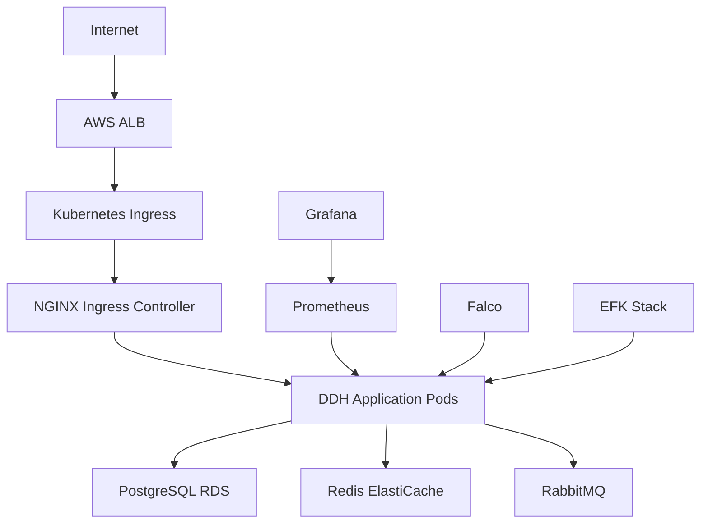

# Domain-Driven Hexagon Production Deployment Guide

## Table of Contents

- [Overview](#overview)
- [Prerequisites](#prerequisites)
- [Infrastructure Setup](#infrastructure-setup)
- [Security Configuration](#security-configuration)
- [Application Deployment](#application-deployment)
- [Monitoring & Observability](#monitoring--observability)
- [Backup & Disaster Recovery](#backup--disaster-recovery)
- [Maintenance & Operations](#maintenance--operations)
- [Troubleshooting](#troubleshooting)
- [Security Checklist](#security-checklist)

## Overview

This guide provides comprehensive instructions for deploying the Domain-Driven Hexagon NestJS application to production with enterprise-grade security, monitoring, and operational practices.

### Architecture Overview



### Key Features

- **Zero-downtime deployments** with blue-green strategy
- **Comprehensive security** with authentication, RBAC, and encryption
- **Enterprise monitoring** with Prometheus, Grafana, and alerting
- **Automated backups** and disaster recovery procedures
- **Compliance ready** for SOC 2, ISO 27001, GDPR, and NIST
- **Infrastructure as Code** with Terraform and Kubernetes manifests

## Prerequisites

### Required Tools

```bash
# Essential tools
brew install kubectl helm terraform jq yq
brew install --cask docker
brew install awscli

# Security and monitoring tools
brew install trivy grype
brew install prometheus grafana
```

### Required Access

- **AWS Account** with appropriate permissions
- **Domain name** for SSL certificates
- **Container registry** access (GitHub Container Registry)
- **Monitoring tools** (Slack, PagerDuty for notifications)

### Required Credentials

- AWS IAM credentials with admin access
- Docker registry authentication
- SSL certificate (or Route53 for Let's Encrypt)
- Database master password
- JWT secrets and encryption keys

## Infrastructure Setup

### Step 1: Prepare AWS Environment

```bash
# 1. Create S3 bucket for Terraform state
aws s3 mb s3://ddh-terraform-state --region us-west-2

# 2. Create DynamoDB table for state locking
aws dynamodb create-table \
  --table-name ddh-terraform-locks \
  --attribute-definitions AttributeName=LockID,AttributeType=S \
  --key-schema AttributeName=LockID,KeyType=HASH \
  --provisioned-throughput ReadCapacityUnits=1,WriteCapacityUnits=1 \
  --region us-west-2

# 3. Enable versioning on state bucket
aws s3api put-bucket-versioning \
  --bucket ddh-terraform-state \
  --versioning-configuration Status=Enabled
```

### Step 2: Configure Terraform Variables

Create `terraform/terraform.tfvars`:

```hcl
# Project configuration
project_name = "domain-driven-hexagon"
environment  = "production"
owner        = "platform-team"

# AWS configuration
aws_region = "us-west-2"

# Kubernetes configuration
kubernetes_version = "1.28"
node_instance_types = ["t3.large", "t3.xlarge"]
node_group_min_size = 3
node_group_max_size = 10
node_group_desired_size = 3

# Database configuration
db_instance_class = "db.t3.large"
db_allocated_storage = 100
db_backup_retention_period = 30
db_multi_az = true

# Redis configuration
redis_node_type = "cache.r6g.large"
redis_num_cache_nodes = 2

# Domain configuration
domain_name = "yourdomain.com"
subdomain = "api"
route53_zone_id = "Z1XXXXXXXXXXXXX"

# Security configuration
enable_waf = true
enable_shield = false
compliance_framework = "SOC2"

# Notification configuration
notification_email = "alerts@yourdomain.com"
```

### Step 3: Deploy Infrastructure

```bash
cd terraform

# Initialize Terraform
terraform init

# Plan deployment
terraform plan -var-file=terraform.tfvars

# Apply infrastructure
terraform apply -var-file=terraform.tfvars

# Configure kubectl
aws eks update-kubeconfig --region us-west-2 --name ddh-production-cluster
```

### Step 4: Install Essential Kubernetes Add-ons

```bash
# Install AWS Load Balancer Controller
helm repo add eks https://aws.github.io/eks-charts
helm repo update

helm install aws-load-balancer-controller eks/aws-load-balancer-controller \
  -n kube-system \
  --set clusterName=ddh-production-cluster \
  --set serviceAccount.create=false \
  --set serviceAccount.name=aws-load-balancer-controller

# Install External Secrets Operator
helm repo add external-secrets https://charts.external-secrets.io
helm install external-secrets external-secrets/external-secrets \
  -n external-secrets \
  --create-namespace

# Install Cert-Manager
helm repo add jetstack https://charts.jetstack.io
helm install cert-manager jetstack/cert-manager \
  --namespace cert-manager \
  --create-namespace \
  --set installCRDs=true

# Install Falco for runtime security
helm repo add falcosecurity https://falcosecurity.github.io/charts
helm install falco falcosecurity/falco \
  --namespace falco-system \
  --create-namespace \
  --set falco.grpc.enabled=true \
  --set falco.grpcOutput.enabled=true
```

## Security Configuration

### Step 1: Configure Secrets Management

```bash
# Create namespace
kubectl apply -f k8s/namespace.yaml

# Generate and store secrets in AWS Secrets Manager
aws secretsmanager create-secret \
  --name ddh-production-app-secrets \
  --description "Application secrets for DDH production" \
  --secret-string '{
    "jwt_secret": "'$(openssl rand -base64 32)'",
    "encryption_key": "'$(openssl rand -base64 32)'",
    "session_secret": "'$(openssl rand -base64 32)'"
  }'

# Configure External Secrets
kubectl apply -f k8s/secrets.yaml
```

### Step 2: Apply Security Policies

```bash
# Apply Pod Security Standards
kubectl label namespace ddh-production pod-security.kubernetes.io/enforce=restricted
kubectl label namespace ddh-production pod-security.kubernetes.io/audit=restricted
kubectl label namespace ddh-production pod-security.kubernetes.io/warn=restricted

# Apply Network Policies
kubectl apply -f k8s/namespace.yaml

# Apply Falco security rules
kubectl create configmap falco-rules \
  --from-file=security/falco-rules.yaml \
  -n falco-system

# Apply security policy
kubectl apply -f security/security-policy.yaml
```

### Step 3: Configure SSL/TLS

```bash
# Apply cluster issuer for Let's Encrypt
kubectl apply -f k8s/ingress.yaml

# Verify certificate creation
kubectl get certificates -n ddh-production
kubectl describe certificate ddh-tls-certificate -n ddh-production
```

## Application Deployment

### Step 1: Build and Push Container Images

```bash
# Build production image
./devtools/scripts/docker-build.sh production v1.0.0

# Run security scan
./devtools/scripts/security-scan.sh ghcr.io/danilomartinelli/domain-driven-hexagon/ddh-app:v1.0.0

# Push to registry (done automatically by CI/CD)
```

### Step 2: Configure Application

```bash
# Apply ConfigMaps
kubectl apply -f k8s/configmap.yaml

# Apply database configuration
kubectl apply -f k8s/database-deployment.yaml

# Wait for database to be ready
kubectl wait --for=condition=ready pod -l app=ddh-postgres --timeout=300s -n ddh-production
```

### Step 3: Deploy Application

```bash
# Apply application deployment
kubectl apply -f k8s/app-deployment.yaml

# Apply services
kubectl apply -f k8s/services.yaml

# Apply ingress
kubectl apply -f k8s/ingress.yaml

# Verify deployment
kubectl get pods -n ddh-production
kubectl get services -n ddh-production
kubectl get ingress -n ddh-production
```

### Step 4: Database Migrations

```bash
# Run database migrations
kubectl create job ddh-migration-$(date +%Y%m%d-%H%M%S) \
  --from=deployment/ddh-app \
  --dry-run=client -o yaml \
  -n ddh-production | \
  sed 's/restartPolicy: Always/restartPolicy: OnFailure/' | \
  sed 's/name: ddh-app/name: migration/' | \
  kubectl apply -f -

# Monitor migration job
kubectl logs -f job/ddh-migration-$(date +%Y%m%d-%H%M%S) -n ddh-production
```

## Monitoring & Observability

### Step 1: Deploy Monitoring Stack

```bash
# Deploy Prometheus and Grafana
kubectl apply -f k8s/monitoring-deployment.yaml

# Wait for pods to be ready
kubectl wait --for=condition=ready pod -l app=ddh-prometheus --timeout=300s -n ddh-production
kubectl wait --for=condition=ready pod -l app=ddh-grafana --timeout=300s -n ddh-production
```

### Step 2: Configure Alerting

```bash
# Apply Prometheus rules
kubectl create configmap ddh-prometheus-rules \
  --from-file=devtools/prometheus/rules/ \
  -n ddh-production

# Configure AlertManager
kubectl create configmap ddh-alertmanager-config \
  --from-file=devtools/alertmanager/alertmanager.yml \
  -n ddh-production

# Restart Prometheus to load rules
kubectl rollout restart deployment/ddh-prometheus -n ddh-production
```

### Step 3: Access Monitoring Dashboards

```bash
# Get Grafana admin password
kubectl get secret ddh-monitoring-secrets \
  -o jsonpath="{.data.grafana-admin-password}" -n ddh-production | base64 --decode

# Port forward for initial access
kubectl port-forward service/ddh-grafana-service 3000:3000 -n ddh-production

# Access Grafana at http://localhost:3000
# Username: admin
# Password: (from above command)
```

### Step 4: Configure Log Aggregation

```bash
# Deploy EFK stack (if using)
helm repo add elastic https://helm.elastic.co
helm install elasticsearch elastic/elasticsearch -n logging --create-namespace
helm install kibana elastic/kibana -n logging
helm install filebeat elastic/filebeat -n logging
```

## Backup & Disaster Recovery

### Step 1: Configure Database Backups

```bash
# Database backups are automatically configured via RDS
# Verify backup configuration
aws rds describe-db-instances \
  --db-instance-identifier ddh-production-db \
  --query 'DBInstances[0].BackupRetentionPeriod'

# Test point-in-time recovery capability
aws rds describe-db-instance-automated-backups \
  --db-instance-identifier ddh-production-db
```

### Step 2: Application Data Backup

```bash
# Create backup of application secrets
kubectl get secrets -n ddh-production -o yaml > backup/secrets-$(date +%Y%m%d).yaml

# Create backup of ConfigMaps
kubectl get configmaps -n ddh-production -o yaml > backup/configmaps-$(date +%Y%m%d).yaml

# Encrypt and store backups securely
gpg --encrypt --recipient ops@yourdomain.com backup/secrets-$(date +%Y%m%d).yaml
```

### Step 3: Test Disaster Recovery

```bash
# Test database restore (use test environment)
aws rds restore-db-instance-from-db-snapshot \
  --db-instance-identifier ddh-test-restore \
  --db-snapshot-identifier ddh-production-db-snapshot

# Test application deployment from backups
kubectl create namespace ddh-test-recovery
kubectl apply -f backup/configmaps-$(date +%Y%m%d).yaml -n ddh-test-recovery
kubectl apply -f backup/secrets-$(date +%Y%m%d).yaml -n ddh-test-recovery
```

## Maintenance & Operations

### Routine Maintenance Tasks

#### Daily Tasks

```bash
#!/bin/bash
# daily-maintenance.sh

# Check cluster health
kubectl get nodes
kubectl get pods -A --field-selector=status.phase!=Running

# Check resource usage
kubectl top nodes
kubectl top pods -A --sort-by=cpu

# Check certificate expiration
kubectl get certificates -A

# Review security alerts
kubectl logs -l app=falco -n falco-system --since=24h | grep -i "priority.*warning\|priority.*error"

# Check backup status
aws rds describe-db-snapshots \
  --db-instance-identifier ddh-production-db \
  --snapshot-type automated \
  --max-items 5
```

#### Weekly Tasks

```bash
#!/bin/bash
# weekly-maintenance.sh

# Update cluster and node groups
aws eks update-cluster-version \
  --name ddh-production-cluster \
  --version $(aws eks describe-cluster --name ddh-production-cluster --query 'cluster.version' --output text)

# Security scanning
./security/compliance-scan.sh

# Performance review
kubectl top nodes
kubectl top pods -A --sort-by=memory

# Review and rotate secrets
aws secretsmanager get-secret-value \
  --secret-id ddh-production-app-secrets \
  --query 'CreatedDate'
```

#### Monthly Tasks

```bash
#!/bin/bash
# monthly-maintenance.sh

# Update dependencies
helm repo update
helm list -A

# Review and clean up old resources
kubectl get jobs -A --sort-by=.metadata.creationTimestamp
kubectl delete jobs -A --field-selector=status.successful=1

# Disaster recovery test
# (Run DR tests in separate test environment)

# Security audit
trivy k8s cluster --report summary

# Cost optimization review
aws ce get-cost-and-usage \
  --time-period Start=2024-01-01,End=2024-01-31 \
  --granularity MONTHLY \
  --metrics BlendedCost \
  --group-by Type=DIMENSION,Key=SERVICE
```

### Scaling Operations

#### Horizontal Pod Autoscaling

```bash
# Check HPA status
kubectl get hpa -n ddh-production

# Manual scaling (if needed)
kubectl scale deployment/ddh-app --replicas=5 -n ddh-production

# Check scaling events
kubectl describe hpa ddh-app-hpa -n ddh-production
```

#### Cluster Scaling

```bash
# Scale node groups
aws eks update-nodegroup-config \
  --cluster-name ddh-production-cluster \
  --nodegroup-name primary \
  --scaling-config minSize=3,maxSize=15,desiredSize=5

# Check cluster autoscaler logs
kubectl logs -f deployment/cluster-autoscaler -n kube-system
```

### Updates and Deployments

#### Rolling Updates

```bash
# Update application image
kubectl set image deployment/ddh-app \
  ddh-app=ghcr.io/danilomartinelli/domain-driven-hexagon/ddh-app:v1.1.0 \
  -n ddh-production

# Monitor rollout
kubectl rollout status deployment/ddh-app -n ddh-production

# Rollback if needed
kubectl rollout undo deployment/ddh-app -n ddh-production
```

#### Blue-Green Deployments

```bash
# Create green environment
kubectl apply -f k8s/app-deployment-green.yaml

# Test green environment
kubectl port-forward service/ddh-app-service-green 3001:3000 -n ddh-production

# Switch traffic (update ingress)
kubectl patch ingress ddh-app-ingress \
  -p '{"spec":{"rules":[{"host":"api.yourdomain.com","http":{"paths":[{"path":"/","pathType":"Prefix","backend":{"service":{"name":"ddh-app-service-green","port":{"number":3000}}}}]}}]}}' \
  -n ddh-production

# Monitor and cleanup blue environment
kubectl delete -f k8s/app-deployment-blue.yaml
```

## Troubleshooting

### Common Issues and Solutions

#### Pod Startup Issues

```bash
# Check pod status
kubectl get pods -n ddh-production
kubectl describe pod <pod-name> -n ddh-production

# Check logs
kubectl logs <pod-name> -n ddh-production --previous

# Check events
kubectl get events -n ddh-production --sort-by='.lastTimestamp'

# Check resource constraints
kubectl top pod <pod-name> -n ddh-production
kubectl describe node <node-name>
```

#### Database Connection Issues

```bash
# Check database status
aws rds describe-db-instances --db-instance-identifier ddh-production-db

# Test connection from pod
kubectl exec -it <app-pod> -n ddh-production -- \
  psql -h ddh-postgres-service -U ddh_app -d ddh_production -c '\l'

# Check security groups
aws ec2 describe-security-groups \
  --group-ids sg-xxx --query 'SecurityGroups[].IpPermissions'

# Check DNS resolution
kubectl exec -it <app-pod> -n ddh-production -- nslookup ddh-postgres-service
```

#### Performance Issues

```bash
# Check resource usage
kubectl top pods -n ddh-production --sort-by=cpu
kubectl top nodes

# Check HPA status
kubectl get hpa -n ddh-production
kubectl describe hpa ddh-app-hpa -n ddh-production

# Check application metrics
curl -s http://localhost:3000/metrics | grep ddh_

# Check database performance
aws rds describe-db-instances \
  --db-instance-identifier ddh-production-db \
  --query 'DBInstances[0].PerformanceInsightsEnabled'
```

#### Network Issues

```bash
# Check service endpoints
kubectl get endpoints -n ddh-production

# Test service connectivity
kubectl exec -it <app-pod> -n ddh-production -- \
  curl -v http://ddh-redis-service:6379

# Check network policies
kubectl get networkpolicies -n ddh-production
kubectl describe networkpolicy <policy-name> -n ddh-production

# Check ingress
kubectl get ingress -n ddh-production
kubectl describe ingress ddh-app-ingress -n ddh-production
```

#### Security Issues

```bash
# Check Falco alerts
kubectl logs -l app=falco -n falco-system --since=1h | grep -i "priority.*warning\|priority.*error"

# Check security policies
kubectl auth can-i --list --as=system:serviceaccount:ddh-production:ddh-app-sa -n ddh-production

# Check pod security
kubectl get pods -n ddh-production -o jsonpath='{.items[*].spec.securityContext}'

# Run security scan
trivy k8s namespace ddh-production
```

### Emergency Procedures

#### Application Down

```bash
# 1. Check application status
kubectl get pods -n ddh-production -l app=ddh-app

# 2. Check recent events
kubectl get events -n ddh-production --sort-by='.lastTimestamp' | tail -20

# 3. Scale up replicas if needed
kubectl scale deployment/ddh-app --replicas=5 -n ddh-production

# 4. Check external dependencies
kubectl exec -it <app-pod> -n ddh-production -- \
  curl -v http://ddh-postgres-service:5432

# 5. Emergency rollback
kubectl rollout undo deployment/ddh-app -n ddh-production

# 6. Notify stakeholders
echo "Application incident detected at $(date)" | \
  slack-notify "#incident-response"
```

#### Database Emergency

```bash
# 1. Check database status
aws rds describe-db-instances --db-instance-identifier ddh-production-db

# 2. Check recent backups
aws rds describe-db-snapshots \
  --db-instance-identifier ddh-production-db \
  --snapshot-type automated

# 3. Scale down application to reduce load
kubectl scale deployment/ddh-app --replicas=1 -n ddh-production

# 4. Enable read-only mode if possible
kubectl set env deployment/ddh-app READ_ONLY_MODE=true -n ddh-production

# 5. Initiate point-in-time recovery if needed
aws rds restore-db-instance-to-point-in-time \
  --source-db-instance-identifier ddh-production-db \
  --target-db-instance-identifier ddh-production-db-recovery \
  --restore-time $(date -u -d '1 hour ago' +%Y-%m-%dT%H:%M:%S)
```

#### Security Incident

```bash
# 1. Isolate affected pods
kubectl label pod <affected-pod> quarantine=true -n ddh-production
kubectl patch networkpolicy ddh-app-network-policy \
  --type='json' -p='[{"op": "add", "path": "/spec/podSelector/matchLabels/quarantine", "value": "false"}]' \
  -n ddh-production

# 2. Collect forensic data
kubectl logs <affected-pod> -n ddh-production > /tmp/incident-logs-$(date +%s).log
kubectl describe pod <affected-pod> -n ddh-production > /tmp/incident-pod-$(date +%s).yaml

# 3. Check for lateral movement
kubectl logs -l app=falco -n falco-system --since=24h | \
  grep -i "container.*escape\|privilege.*escalation\|suspicious"

# 4. Rotate potentially compromised secrets
kubectl delete secret ddh-app-secrets -n ddh-production
# (External Secrets Operator will recreate from AWS)

# 5. Notify security team
echo "Security incident detected at $(date). Pod $AFFECTED_POD isolated." | \
  security-notify
```

## Security Checklist

### Pre-Deployment Security Checklist

- [ ] All secrets stored in AWS Secrets Manager
- [ ] Non-root containers configured
- [ ] Read-only root filesystems enabled
- [ ] Security contexts properly configured
- [ ] Network policies implemented
- [ ] Pod Security Standards enforced
- [ ] RBAC roles follow least privilege
- [ ] Resource limits configured
- [ ] Health checks implemented
- [ ] TLS encryption enabled end-to-end
- [ ] Container images scanned for vulnerabilities
- [ ] Base images are minimal and up-to-date
- [ ] No hardcoded secrets in code or configs
- [ ] Admission controllers configured
- [ ] Audit logging enabled

### Post-Deployment Security Checklist

- [ ] Runtime security monitoring active (Falco)
- [ ] Security alerts configured and tested
- [ ] Incident response procedures documented
- [ ] Regular security scanning scheduled
- [ ] Access logs being collected and monitored
- [ ] Backup and recovery procedures tested
- [ ] Compliance scanning automated
- [ ] Security training completed for team
- [ ] Vulnerability management process in place
- [ ] Regular security assessments scheduled

### Ongoing Security Monitoring

- [ ] Daily review of security alerts
- [ ] Weekly vulnerability scans
- [ ] Monthly compliance reports
- [ ] Quarterly security assessments
- [ ] Annual penetration testing
- [ ] Regular security awareness training
- [ ] Incident response drills
- [ ] Access review and cleanup
- [ ] Certificate rotation monitoring
- [ ] Secret rotation procedures

## Conclusion

This production deployment guide provides comprehensive coverage of deploying the Domain-Driven Hexagon application with enterprise-grade security and operational practices. Regular review and updates of these procedures ensure continued security and reliability in production environments.

For additional support or questions, contact the Platform Engineering team or refer to the project's documentation and runbooks.

---
**Document Version**: 1.0  
**Last Updated**: December 2024  
**Next Review**: March 2025