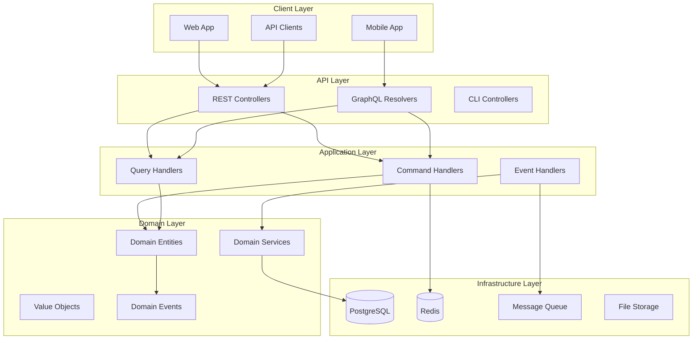

# Documentation Hub

Welcome to the comprehensive documentation for the Domain-Driven Hexagon project! This documentation hub provides everything you need to understand, develop, and deploy this modern Domain-Driven Design implementation.

## 🚀 Quick Navigation

### Getting Started
- **[Getting Started Guide](guides/GETTING_STARTED.md)** - Complete setup and first steps
- **[Project README](../README.md)** - Project overview and basic setup
- **[Development Commands](../CLAUDE.md)** - Common development commands

### Architecture & Design
- **[System Architecture](architecture/ARCHITECTURE.md)** - Comprehensive architecture overview
- **[Domain Model](architecture/domain-model.md)** - Detailed domain model documentation
- **[Design Patterns](architecture/ARCHITECTURE.md#design-patterns)** - DDD, CQRS, and Hexagonal Architecture

### API Documentation
- **[API Guide](api/API_GUIDE.md)** - Complete API documentation with examples
- **[OpenAPI Specification](api/openapi.yaml)** - Machine-readable API specification
- **[Interactive API Docs](../README.md#api-documentation)** - Swagger UI and GraphQL Playground

### Development Resources
- **[Development Best Practices](guides/DEVELOPMENT_BEST_PRACTICES.md)** - Coding standards and patterns
- **[Developer Guide](../docs/DEVELOPER_GUIDE.md)** - Advanced development topics
- **[Production Deployment](../docs/PRODUCTION_DEPLOYMENT_GUIDE.md)** - Deployment guide

### Generated Documentation
*Generated automatically by CI/CD pipeline*
- **[API Summary](generated/api-summary.md)** - Overview of all API endpoints
- **[Domain Model Overview](generated/domain-model-overview.md)** - Domain components summary
- **[Module Overview](generated/modules-overview.md)** - Business modules structure
- **[Documentation Coverage](generated/documentation-coverage.md)** - Coverage metrics

## 📊 Project Statistics

| Metric | Value |
|--------|-------|
| **TypeScript Version** | 5.9+ |
| **NestJS Version** | 11.1+ |
| **Node.js Version** | 24.0+ |
| **Database** | PostgreSQL 16+ |
| **Architecture** | Hexagonal + DDD + CQRS |

## 🏗️ Architecture Overview



## 🚦 Quick Start Checklist

- [ ] **Prerequisites**: Node.js 24+, Docker, Git
- [ ] **Clone Repository**: `git clone https://github.com/danilomartinelli/domain-driven-hexagon.git`
- [ ] **Install Dependencies**: `npm install`
- [ ] **Start Services**: `docker compose up -d`
- [ ] **Run Migrations**: `npm run migration:up`
- [ ] **Start Development**: `npm run start:dev`
- [ ] **Verify Setup**: Visit http://localhost:3000/api

## 🎯 Key Features

### Domain-Driven Design
- **Bounded Contexts**: Clear business domain boundaries
- **Aggregates**: User and Wallet aggregates with business rules
- **Value Objects**: Email, Address, Money with validation
- **Domain Events**: Decoupled communication between contexts

### Hexagonal Architecture
- **Ports & Adapters**: Clean separation of concerns
- **Dependency Inversion**: Dependencies point inward
- **Testability**: Easy to test business logic in isolation
- **Flexibility**: Easy to swap external integrations

### CQRS Pattern
- **Command Side**: Handles write operations
- **Query Side**: Optimized for read operations
- **Event Sourcing**: Audit trail of all changes
- **Scalability**: Independent scaling of reads/writes

### Modern Technology Stack
- **NestJS**: Enterprise-grade Node.js framework
- **TypeScript**: Type safety and developer experience
- **PostgreSQL**: Reliable relational database
- **Slonik**: Type-safe SQL query builder
- **GraphQL**: Flexible API for modern clients

## 📚 Learning Path

### Beginner
1. Read the [Getting Started Guide](guides/GETTING_STARTED.md)
2. Explore the [Project README](../README.md)
3. Follow the setup instructions
4. Try creating your first user via API

### Intermediate
1. Study the [Architecture Documentation](architecture/ARCHITECTURE.md)
2. Understand the [Domain Model](architecture/domain-model.md)
3. Review [Development Best Practices](guides/DEVELOPMENT_BEST_PRACTICES.md)
4. Implement a simple feature following the patterns

### Advanced
1. Deep dive into the codebase structure
2. Add a new bounded context
3. Implement complex business rules
4. Deploy to production using the [Deployment Guide](../docs/PRODUCTION_DEPLOYMENT_GUIDE.md)

## 🛠️ Documentation Tools

### Generate Documentation
```bash
# Generate all documentation
npm run docs:build

# Generate code analysis
npm run docs:generate

# Extract OpenAPI specification
npm run docs:openapi

# Lint documentation
npm run docs:lint

# Serve documentation locally
npm run docs:serve
```

### Continuous Integration
The documentation is automatically generated and deployed via GitHub Actions:
- **Trigger**: Push to main branch or changes to docs/
- **Generates**: API docs, architecture diagrams, coverage reports
- **Deploys**: GitHub Pages for public access
- **Validates**: Link checking, markdown linting

## 🤝 Contributing to Documentation

### Documentation Standards
- Use clear, concise language
- Include code examples for complex concepts
- Add diagrams for architectural concepts
- Follow the established structure and formatting
- Update related documentation when making changes

### Adding New Documentation
1. Create markdown files in appropriate directories
2. Follow the naming conventions (kebab-case)
3. Add navigation links to this index
4. Include examples and use cases
5. Test all code examples

### Improving Existing Documentation
1. Keep content up-to-date with code changes
2. Add missing sections or examples
3. Fix broken links or outdated information
4. Improve clarity and readability
5. Add visual aids where helpful

## 🔍 Finding Information

### Search Tips
- Use your IDE's global search across the `docs/` directory
- Search for specific terms in this README
- Check the generated documentation for API details
- Look for examples in the guides

### Common Questions
- **"How do I add a new feature?"** → [Development Best Practices](guides/DEVELOPMENT_BEST_PRACTICES.md)
- **"How does the architecture work?"** → [Architecture Documentation](architecture/ARCHITECTURE.md)
- **"How do I use the API?"** → [API Guide](api/API_GUIDE.md)
- **"How do I deploy to production?"** → [Production Deployment Guide](../docs/PRODUCTION_DEPLOYMENT_GUIDE.md)

## 📧 Support

- **Issues**: [GitHub Issues](https://github.com/danilomartinelli/domain-driven-hexagon/issues)
- **Discussions**: [GitHub Discussions](https://github.com/danilomartinelli/domain-driven-hexagon/discussions)
- **Email**: danilo.martinelli@witek.com.br

## 📄 License

This project and its documentation are licensed under the MIT License. See the [LICENSE](../LICENSE) file for details.

---

**Last Updated**: Automatically updated by CI/CD pipeline
**Documentation Version**: 1.0.0
**Project Version**: 1.0.0