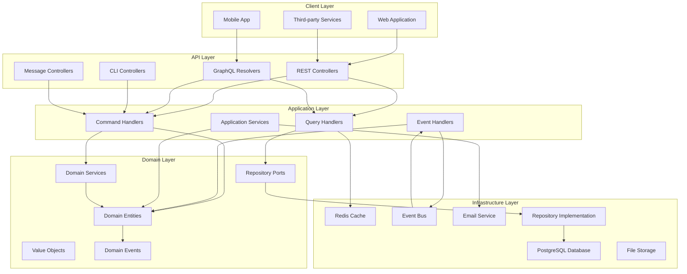
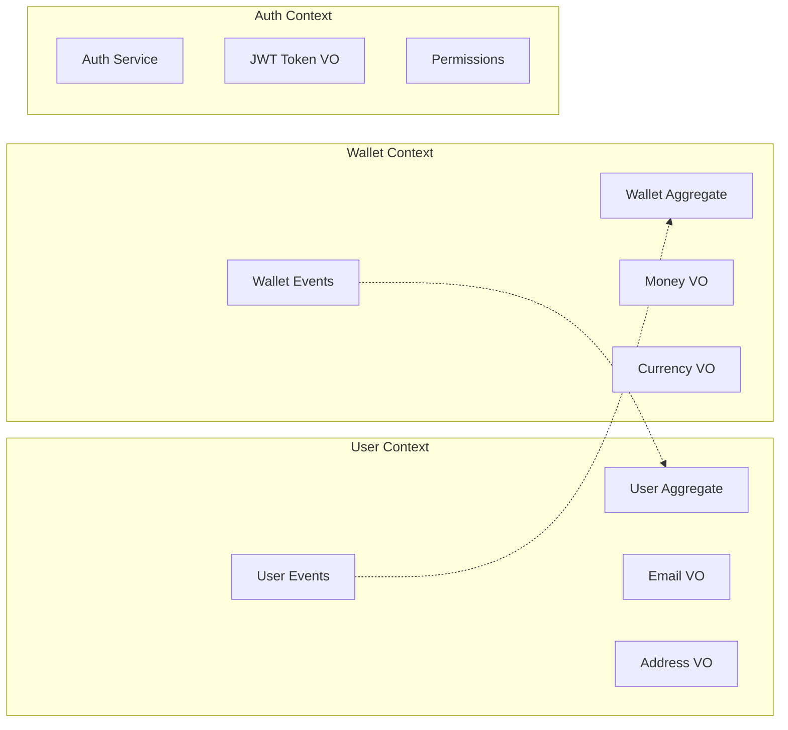
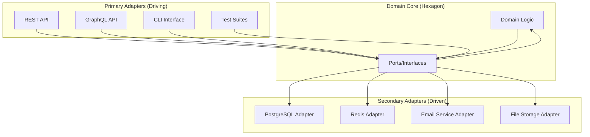
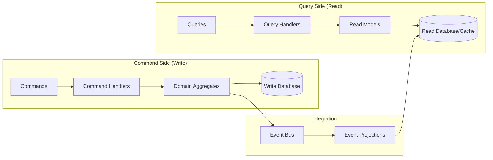
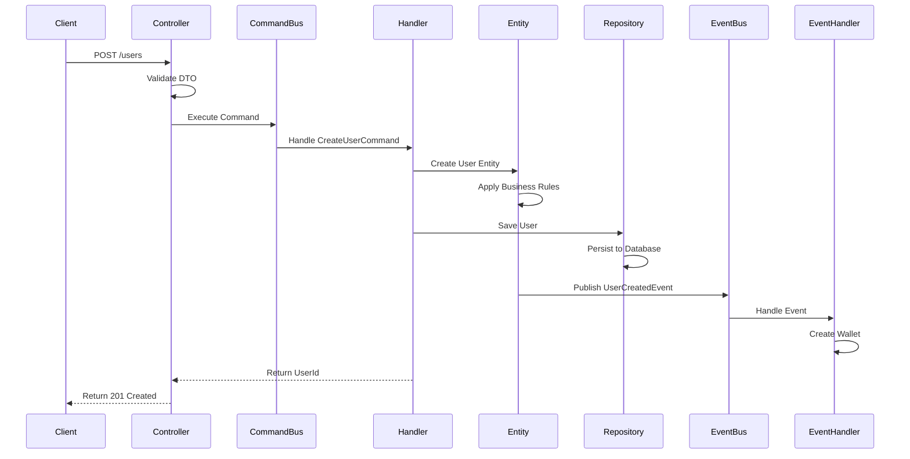
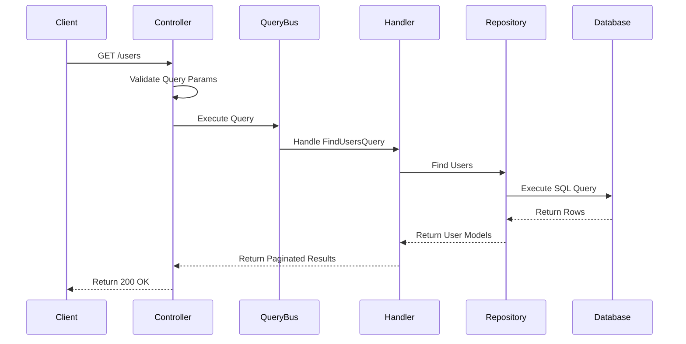
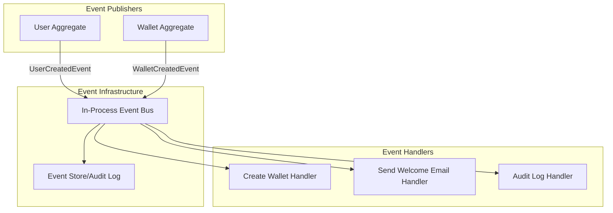
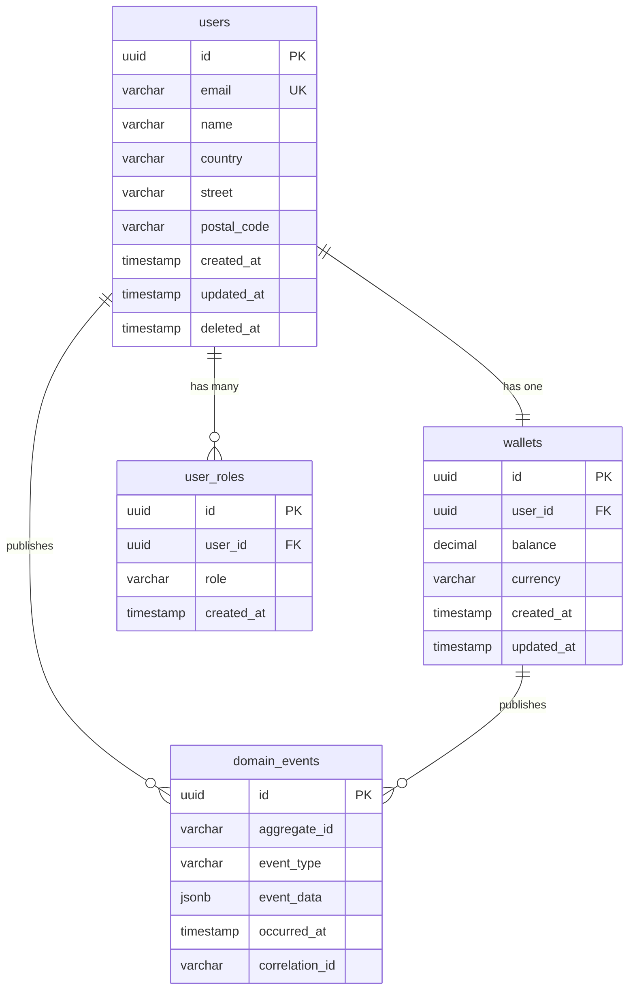
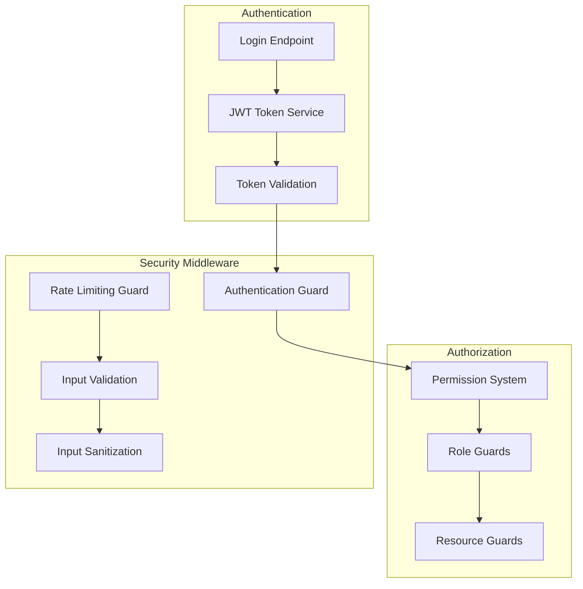

# Architecture Documentation

## Table of Contents

- [Overview](#overview)
- [System Architecture](#system-architecture)
- [Domain-Driven Design](#domain-driven-design)
- [Hexagonal Architecture](#hexagonal-architecture)
- [CQRS Pattern](#cqrs-pattern)
- [Module Structure](#module-structure)
- [Data Flow](#data-flow)
- [Domain Events](#domain-events)
- [Database Design](#database-design)
- [Security Architecture](#security-architecture)

## Overview

The Domain-Driven Hexagon project implements a sophisticated architecture that combines multiple design patterns and principles to create a maintainable, testable, and scalable application.

### Core Architectural Principles

1. **Domain-Driven Design (DDD)**: Business logic is organized around domain concepts
2. **Hexagonal Architecture**: Clean separation between business logic and external concerns
3. **CQRS Pattern**: Separate models for reading and writing operations
4. **Event-Driven Architecture**: Loose coupling through domain events
5. **Dependency Inversion**: Dependencies point inward to the domain

### Key Benefits

- **Testability**: Each layer can be tested in isolation
- **Maintainability**: Clear boundaries and responsibilities
- **Flexibility**: Easy to change external integrations
- **Scalability**: Commands and queries can scale independently
- **Domain Focus**: Business logic remains pure and focused

## System Architecture



## Domain-Driven Design

### Bounded Contexts

The application is organized into distinct bounded contexts, each representing a specific business domain:



### Domain Model Components

#### 1. Aggregates

**User Aggregate** (`src/modules/user/domain/user.entity.ts`)
- **Purpose**: Manages user identity and personal information
- **Invariants**: Email uniqueness, valid address components
- **Commands**: CreateUser, UpdateUser, DeleteUser
- **Events**: UserCreated, UserUpdated, UserDeleted

**Wallet Aggregate** (`src/modules/wallet/domain/wallet.entity.ts`)
- **Purpose**: Manages financial balance and transactions
- **Invariants**: Non-negative balance, currency consistency
- **Commands**: CreateWallet, Deposit, Withdraw
- **Events**: WalletCreated, MoneyDeposited, MoneyWithdrawn

#### 2. Value Objects

**Email** (`src/modules/user/domain/value-objects/email.value-object.ts`)
```typescript
export class Email extends ValueObject<string> {
  constructor(value: string) {
    super({ value });
    this.validate();
  }

  private validate(): void {
    if (!this.isValidEmail(this.props.value)) {
      throw new ArgumentInvalidException('Invalid email format');
    }
  }
}
```

**Address** (`src/modules/user/domain/value-objects/address.value-object.ts`)
```typescript
export class Address extends ValueObject<AddressProps> {
  constructor(props: AddressProps) {
    super(props);
    this.validate();
  }

  get country(): string {
    return this.props.country;
  }

  get street(): string {
    return this.props.street;
  }

  get postalCode(): string {
    return this.props.postalCode;
  }
}
```

#### 3. Domain Services

Domain services handle business logic that doesn't naturally fit within a single aggregate:

```typescript
@Injectable()
export class WalletDomainService {
  transferMoney(
    fromWallet: WalletEntity,
    toWallet: WalletEntity,
    amount: Money
  ): void {
    // Complex business logic spanning multiple aggregates
    fromWallet.withdraw(amount);
    toWallet.deposit(amount);
  }
}
```

## Hexagonal Architecture

### Ports and Adapters

The hexagonal architecture ensures that the domain layer remains isolated from external concerns:



### Repository Pattern Implementation

```typescript
// Domain Port (Interface)
export interface UserRepositoryPort {
  findById(id: UserId): Promise<UserEntity | null>;
  findByEmail(email: Email): Promise<UserEntity | null>;
  save(user: UserEntity): Promise<void>;
  delete(id: UserId): Promise<void>;
}

// Infrastructure Adapter (Implementation)
@Injectable()
export class UserRepository implements UserRepositoryPort {
  constructor(private readonly database: DatabaseService) {}

  async findById(id: UserId): Promise<UserEntity | null> {
    // Database-specific implementation
    const result = await this.database.query(sql`
      SELECT * FROM users WHERE id = ${id.value}
    `);

    return result.rows[0] ? this.toDomainEntity(result.rows[0]) : null;
  }

  // More implementations...
}
```

## CQRS Pattern

Commands and Queries are strictly separated to enable independent scaling and optimization:



### Command Flow

1. **API Layer** receives HTTP request
2. **Controller** creates and validates Command DTO
3. **Command Handler** processes business logic
4. **Domain Entity** applies business rules
5. **Repository** persists changes
6. **Domain Events** are published
7. **Event Handlers** update read models

### Query Flow

1. **API Layer** receives HTTP request
2. **Controller** creates Query DTO
3. **Query Handler** retrieves data
4. **Read Model** provides optimized data structure
5. **Response DTO** formats output

## Module Structure

Each business domain follows a consistent structure:

```
src/modules/{domain}/
├── commands/                    # Write Operations
│   ├── create-{entity}/
│   │   ├── create-{entity}.command.ts
│   │   ├── create-{entity}.service.ts
│   │   ├── create-{entity}.http.controller.ts
│   │   ├── create-{entity}.request.dto.ts
│   │   └── create-{entity}.cli.controller.ts
│   └── update-{entity}/
├── queries/                     # Read Operations
│   ├── find-{entities}/
│   │   ├── find-{entities}.query-handler.ts
│   │   ├── find-{entities}.http.controller.ts
│   │   ├── find-{entities}.graphql-resolver.ts
│   │   └── find-{entities}.request.dto.ts
│   └── get-{entity}/
├── domain/                      # Core Business Logic
│   ├── entities/
│   │   └── {entity}.entity.ts
│   ├── value-objects/
│   │   ├── {value-object}.value-object.ts
│   │   └── ...
│   ├── events/
│   │   ├── {entity}-created.domain-event.ts
│   │   └── ...
│   ├── services/
│   │   └── {domain}.service.ts
│   └── {entity}.types.ts
├── database/                    # Persistence Layer
│   ├── {entity}.repository.port.ts
│   ├── {entity}.repository.ts
│   └── {entity}.mapper.ts
├── dtos/                       # Data Transfer Objects
│   ├── {entity}.response.dto.ts
│   ├── {entity}.paginated.response.dto.ts
│   └── graphql/
│       └── {entity}.graphql-response.dto.ts
├── application/                # Application Services
│   └── event-handlers/
│       └── {event}.handler.ts
├── {domain}.module.ts          # Module Configuration
└── {domain}.di-tokens.ts       # Dependency Injection Tokens
```

## Data Flow

### Command Processing Flow



### Query Processing Flow



## Domain Events

Domain events enable loose coupling between bounded contexts and provide audit trails:

### Event Architecture



### Event Implementation

```typescript
// Domain Event
export class UserCreatedEvent extends DomainEvent {
  constructor(
    public readonly userId: string,
    public readonly email: string,
    public readonly name: string,
  ) {
    super({ aggregateId: userId });
  }
}

// Event Handler
@EventsHandler(UserCreatedEvent)
export class CreateWalletWhenUserCreatedHandler
  implements IEventHandler<UserCreatedEvent> {

  constructor(private readonly commandBus: CommandBus) {}

  async handle(event: UserCreatedEvent): Promise<void> {
    const command = new CreateWalletCommand({
      userId: event.userId,
      initialBalance: 0,
      currency: 'USD',
    });

    await this.commandBus.execute(command);
  }
}
```

## Database Design

### Schema Overview



### Migration Strategy

- **Versioned Migrations**: Each migration has a timestamp and is applied in order
- **Rollback Support**: All migrations include down scripts
- **Data Integrity**: Foreign key constraints and check constraints enforce business rules
- **Performance**: Appropriate indexes for common query patterns

```sql
-- Example Migration: Create Users Table
CREATE TABLE users (
    id UUID PRIMARY KEY DEFAULT gen_random_uuid(),
    email VARCHAR(320) NOT NULL UNIQUE,
    name VARCHAR(100) NOT NULL,
    country VARCHAR(100) NOT NULL,
    street VARCHAR(255) NOT NULL,
    postal_code VARCHAR(20) NOT NULL,
    created_at TIMESTAMP WITH TIME ZONE DEFAULT NOW(),
    updated_at TIMESTAMP WITH TIME ZONE DEFAULT NOW(),
    deleted_at TIMESTAMP WITH TIME ZONE NULL
);

-- Indexes for performance
CREATE INDEX idx_users_email ON users(email) WHERE deleted_at IS NULL;
CREATE INDEX idx_users_created_at ON users(created_at);
```

## Security Architecture

### Authentication & Authorization



### Security Layers

1. **Input Validation**: All inputs validated using class-validator
2. **SQL Injection Prevention**: Parameterized queries with Slonik
3. **Authentication**: JWT-based stateless authentication
4. **Authorization**: Role-based access control (RBAC)
5. **Rate Limiting**: Throttling to prevent abuse
6. **Data Sanitization**: Input sanitization to prevent XSS

### Permission System

```typescript
// Permission Decorator
@RequirePermissions(['user:create'])
export class CreateUserController {
  // Controller implementation
}

// Permission Check Implementation
export class PermissionGuard implements CanActivate {
  canActivate(context: ExecutionContext): boolean {
    const requiredPermissions = this.getRequiredPermissions(context);
    const userPermissions = this.getUserPermissions(context);

    return this.hasAllPermissions(userPermissions, requiredPermissions);
  }
}
```

## Performance Considerations

### Caching Strategy

- **Redis**: Used for session data, frequently accessed queries
- **Database Connection Pooling**: Optimized connection management
- **Query Optimization**: Proper indexing and query structure
- **Lazy Loading**: Domain entities load relationships on demand

### Scaling Patterns

- **Command/Query Separation**: Independent scaling of read/write operations
- **Event-Driven Architecture**: Asynchronous processing of non-critical operations
- **Microservice Ready**: Clear bounded contexts can be extracted as services
- **Database Sharding Ready**: UUIDs and proper data distribution

This architecture provides a solid foundation for building complex, maintainable applications while following established patterns and best practices from the Domain-Driven Design and Clean Architecture communities.