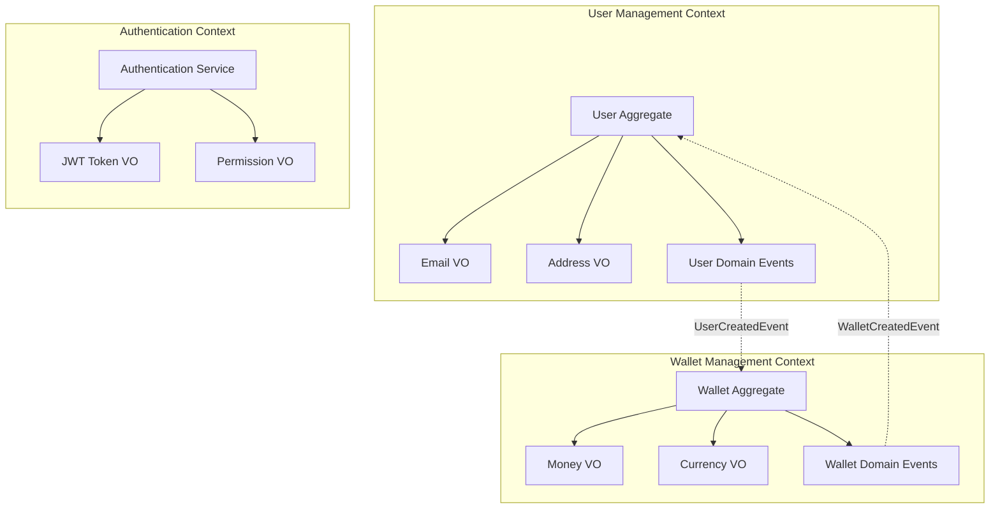
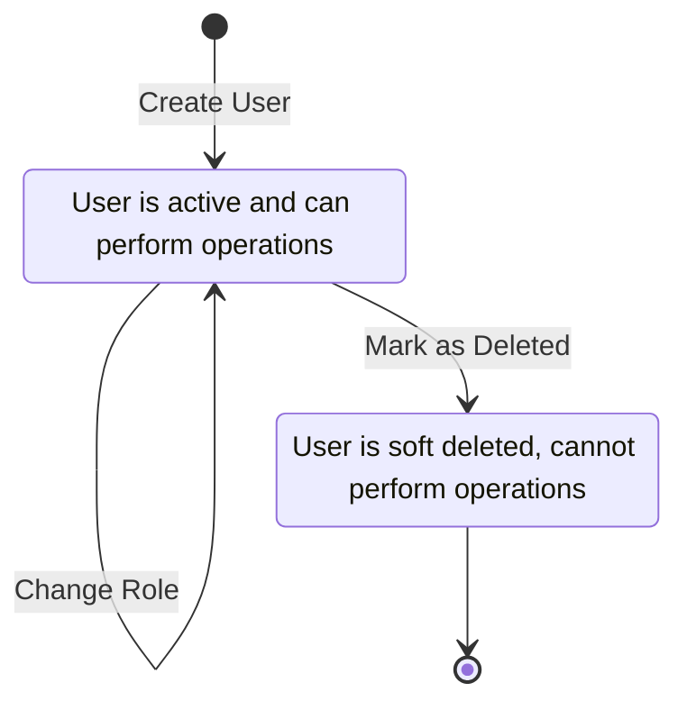
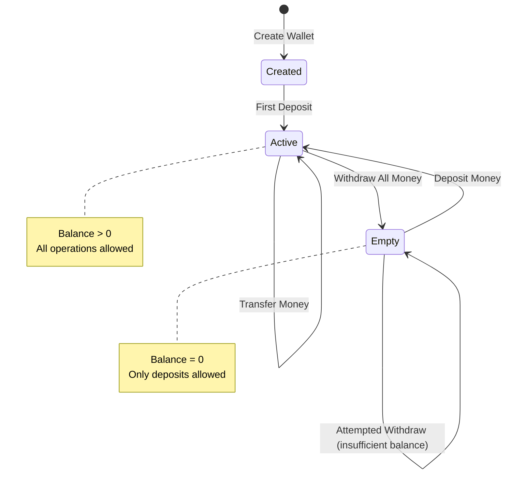
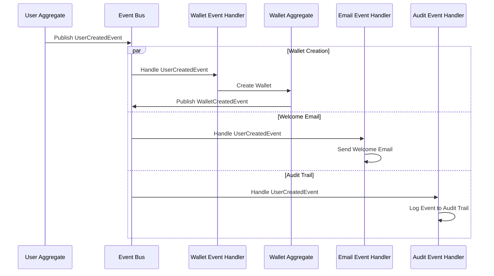
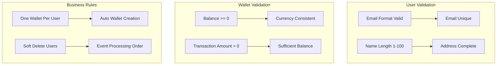

# Domain Model Documentation

This document provides detailed documentation of the domain model, including entities, value objects, aggregates, and their relationships.

## Table of Contents

- [Domain Overview](#domain-overview)
- [Bounded Contexts](#bounded-contexts)
- [User Aggregate](#user-aggregate)
- [Wallet Aggregate](#wallet-aggregate)
- [Value Objects](#value-objects)
- [Domain Events](#domain-events)
- [Business Rules](#business-rules)

## Domain Overview

The Domain-Driven Hexagon application models a user management system with integrated wallet functionality. The domain is organized around two main bounded contexts: User Management and Wallet Management.



## Bounded Contexts

### 1. User Management Context

**Purpose**: Handles user registration, profile management, and user lifecycle operations.

**Responsibilities**:
- User registration and validation
- Profile information management
- User authentication and authorization
- Address management
- User lifecycle (creation, updates, soft deletion)

**Key Concepts**:
- **User**: The main aggregate representing a user in the system
- **Email**: Value object ensuring email uniqueness and validation
- **Address**: Value object encapsulating address information
- **UserRole**: Value object representing user permissions

### 2. Wallet Management Context

**Purpose**: Manages financial aspects of user accounts, including balance tracking and transactions.

**Responsibilities**:
- Wallet creation and management
- Balance tracking
- Transaction processing
- Currency handling
- Financial business rules enforcement

**Key Concepts**:
- **Wallet**: The main aggregate for financial operations
- **Money**: Value object handling monetary amounts
- **Currency**: Value object for currency validation
- **Balance**: Invariant ensuring non-negative balances

### 3. Authentication Context

**Purpose**: Handles authentication, authorization, and security concerns.

**Responsibilities**:
- User authentication
- JWT token management
- Permission and role management
- Security policy enforcement

## User Aggregate

### Entity Structure

```typescript
export class UserEntity extends AggregateRoot<UserProps> {
  private constructor(props: UserProps, id?: AggregateID) {
    super(props, id);
  }

  // Factory method
  static create(props: CreateUserProps): UserEntity {
    const id = AggregateID.generate();
    const user = new UserEntity(
      {
        email: props.email,
        name: props.name,
        address: props.address,
        role: UserRole.USER,
        createdAt: new Date(),
        updatedAt: new Date(),
      },
      id,
    );

    // Add domain event
    user.addEvent(
      new UserCreatedEvent({
        aggregateId: id.value,
        email: props.email.value,
        name: props.name,
      }),
    );

    return user;
  }

  // Getters
  get id(): AggregateID {
    return this._id;
  }

  get email(): Email {
    return this.props.email;
  }

  get name(): string {
    return this.props.name;
  }

  get address(): Address {
    return this.props.address;
  }

  get role(): UserRole {
    return this.props.role;
  }

  // Business methods
  changeEmail(email: Email): void {
    if (this.props.email.equals(email)) {
      return; // No change needed
    }

    this.props.email = email;
    this.props.updatedAt = new Date();

    this.addEvent(
      new UserEmailChangedEvent({
        aggregateId: this.id.value,
        oldEmail: this.props.email.value,
        newEmail: email.value,
      }),
    );
  }

  updateAddress(address: Address): void {
    if (this.props.address.equals(address)) {
      return; // No change needed
    }

    this.props.address = address;
    this.props.updatedAt = new Date();

    this.addEvent(
      new UserAddressUpdatedEvent({
        aggregateId: this.id.value,
        address: address.unpack(),
      }),
    );
  }

  changeRole(role: UserRole): void {
    if (this.props.role === role) {
      return; // No change needed
    }

    const previousRole = this.props.role;
    this.props.role = role;
    this.props.updatedAt = new Date();

    this.addEvent(
      new UserRoleChangedEvent({
        aggregateId: this.id.value,
        previousRole,
        newRole: role,
      }),
    );
  }

  markAsDeleted(): void {
    this.props.deletedAt = new Date();
    this.props.updatedAt = new Date();

    this.addEvent(
      new UserDeletedEvent({
        aggregateId: this.id.value,
        email: this.props.email.value,
      }),
    );
  }

  // Validation
  public validate(): void {
    if (!this.props.email) {
      throw new ArgumentNotProvidedException('User email is required');
    }
    if (!this.props.name) {
      throw new ArgumentNotProvidedException('User name is required');
    }
    if (!this.props.address) {
      throw new ArgumentNotProvidedException('User address is required');
    }
  }
}
```

### User Aggregate Invariants

1. **Email Uniqueness**: No two users can have the same email address
2. **Required Fields**: Email, name, and address are mandatory
3. **Email Format**: Email must be in valid format
4. **Name Length**: User name must be between 1 and 100 characters
5. **Soft Deletion**: Users are marked as deleted, not physically removed

### User State Diagram



## Wallet Aggregate

### Entity Structure

```typescript
export class WalletEntity extends AggregateRoot<WalletProps> {
  private constructor(props: WalletProps, id?: AggregateID) {
    super(props, id);
  }

  // Factory method
  static create(props: CreateWalletProps): WalletEntity {
    const id = AggregateID.generate();
    const wallet = new WalletEntity(
      {
        userId: props.userId,
        balance: Money.create(0, props.currency),
        currency: props.currency,
        createdAt: new Date(),
        updatedAt: new Date(),
      },
      id,
    );

    wallet.addEvent(
      new WalletCreatedEvent({
        aggregateId: id.value,
        userId: props.userId.value,
        currency: props.currency,
      }),
    );

    return wallet;
  }

  // Getters
  get id(): AggregateID {
    return this._id;
  }

  get userId(): AggregateID {
    return this.props.userId;
  }

  get balance(): Money {
    return this.props.balance;
  }

  get currency(): Currency {
    return this.props.currency;
  }

  // Business methods
  deposit(amount: Money): void {
    this.validateCurrency(amount);
    this.validatePositiveAmount(amount);

    const newBalance = this.props.balance.add(amount);
    this.props.balance = newBalance;
    this.props.updatedAt = new Date();

    this.addEvent(
      new MoneyDepositedEvent({
        aggregateId: this.id.value,
        amount: amount.amount,
        currency: amount.currency,
        newBalance: newBalance.amount,
      }),
    );
  }

  withdraw(amount: Money): void {
    this.validateCurrency(amount);
    this.validatePositiveAmount(amount);
    this.validateSufficientBalance(amount);

    const newBalance = this.props.balance.subtract(amount);
    this.props.balance = newBalance;
    this.props.updatedAt = new Date();

    this.addEvent(
      new MoneyWithdrawnEvent({
        aggregateId: this.id.value,
        amount: amount.amount,
        currency: amount.currency,
        newBalance: newBalance.amount,
      }),
    );
  }

  transfer(amount: Money, targetWallet: WalletEntity): void {
    this.withdraw(amount);
    targetWallet.deposit(amount);

    this.addEvent(
      new MoneyTransferredEvent({
        aggregateId: this.id.value,
        targetWalletId: targetWallet.id.value,
        amount: amount.amount,
        currency: amount.currency,
      }),
    );
  }

  // Validation methods
  private validateCurrency(amount: Money): void {
    if (!amount.currency.equals(this.props.currency)) {
      throw new ArgumentInvalidException(
        `Currency mismatch. Wallet currency: ${this.props.currency.code}, Amount currency: ${amount.currency.code}`
      );
    }
  }

  private validatePositiveAmount(amount: Money): void {
    if (amount.amount <= 0) {
      throw new ArgumentInvalidException('Amount must be positive');
    }
  }

  private validateSufficientBalance(amount: Money): void {
    if (this.props.balance.amount < amount.amount) {
      throw new InsufficientBalanceError(
        `Insufficient balance. Current: ${this.props.balance.amount}, Required: ${amount.amount}`
      );
    }
  }

  public validate(): void {
    if (!this.props.userId) {
      throw new ArgumentNotProvidedException('Wallet userId is required');
    }
    if (!this.props.balance) {
      throw new ArgumentNotProvidedException('Wallet balance is required');
    }
    if (!this.props.currency) {
      throw new ArgumentNotProvidedException('Wallet currency is required');
    }
  }
}
```

### Wallet Aggregate Invariants

1. **Non-negative Balance**: Wallet balance cannot go below zero
2. **Currency Consistency**: All operations must use the wallet's currency
3. **User Association**: Each wallet belongs to exactly one user
4. **Positive Transactions**: Transaction amounts must be positive
5. **Balance Tracking**: Balance must be accurately maintained after operations

### Wallet State Diagram



## Value Objects

### Email Value Object

```typescript
export class Email extends ValueObject<EmailProps> {
  constructor(value: string) {
    const props = { value: value.toLowerCase().trim() };
    super(props);
    this.validate();
  }

  get value(): string {
    return this.props.value;
  }

  private validate(): void {
    if (!this.props.value) {
      throw new ArgumentNotProvidedException('Email is required');
    }

    if (!this.isValidEmailFormat(this.props.value)) {
      throw new ArgumentInvalidException('Invalid email format');
    }

    if (this.props.value.length > 320) {
      throw new ArgumentInvalidException('Email too long (max 320 characters)');
    }
  }

  private isValidEmailFormat(email: string): boolean {
    const emailRegex = /^[^\s@]+@[^\s@]+\.[^\s@]+$/;
    return emailRegex.test(email);
  }

  static create(value: string): Email {
    return new Email(value);
  }
}
```

### Address Value Object

```typescript
export class Address extends ValueObject<AddressProps> {
  constructor(props: AddressProps) {
    super(props);
    this.validate();
  }

  get country(): string {
    return this.props.country;
  }

  get street(): string {
    return this.props.street;
  }

  get postalCode(): string {
    return this.props.postalCode;
  }

  get fullAddress(): string {
    return `${this.props.street}, ${this.props.postalCode}, ${this.props.country}`;
  }

  private validate(): void {
    if (!this.props.country) {
      throw new ArgumentNotProvidedException('Country is required');
    }
    if (!this.props.street) {
      throw new ArgumentNotProvidedException('Street is required');
    }
    if (!this.props.postalCode) {
      throw new ArgumentNotProvidedException('Postal code is required');
    }

    if (this.props.country.length < 2 || this.props.country.length > 100) {
      throw new ArgumentInvalidException('Country must be between 2 and 100 characters');
    }

    if (this.props.street.length > 255) {
      throw new ArgumentInvalidException('Street address too long (max 255 characters)');
    }

    if (this.props.postalCode.length > 20) {
      throw new ArgumentInvalidException('Postal code too long (max 20 characters)');
    }
  }

  static create(props: AddressProps): Address {
    return new Address(props);
  }
}
```

### Money Value Object

```typescript
export class Money extends ValueObject<MoneyProps> {
  constructor(props: MoneyProps) {
    super(props);
    this.validate();
  }

  get amount(): number {
    return this.props.amount;
  }

  get currency(): Currency {
    return this.props.currency;
  }

  add(other: Money): Money {
    this.validateSameCurrency(other);
    return new Money({
      amount: this.props.amount + other.props.amount,
      currency: this.props.currency,
    });
  }

  subtract(other: Money): Money {
    this.validateSameCurrency(other);
    const newAmount = this.props.amount - other.props.amount;

    if (newAmount < 0) {
      throw new ArgumentInvalidException('Result cannot be negative');
    }

    return new Money({
      amount: newAmount,
      currency: this.props.currency,
    });
  }

  multiply(factor: number): Money {
    if (factor < 0) {
      throw new ArgumentInvalidException('Factor cannot be negative');
    }

    return new Money({
      amount: this.props.amount * factor,
      currency: this.props.currency,
    });
  }

  isGreaterThan(other: Money): boolean {
    this.validateSameCurrency(other);
    return this.props.amount > other.props.amount;
  }

  isLessThan(other: Money): boolean {
    this.validateSameCurrency(other);
    return this.props.amount < other.props.amount;
  }

  private validate(): void {
    if (this.props.amount < 0) {
      throw new ArgumentInvalidException('Amount cannot be negative');
    }

    if (!this.props.currency) {
      throw new ArgumentNotProvidedException('Currency is required');
    }
  }

  private validateSameCurrency(other: Money): void {
    if (!this.props.currency.equals(other.props.currency)) {
      throw new ArgumentInvalidException(
        `Cannot operate on different currencies: ${this.props.currency.code} and ${other.props.currency.code}`
      );
    }
  }

  static create(amount: number, currency: Currency): Money {
    return new Money({ amount, currency });
  }
}
```

## Domain Events

### User Domain Events

```typescript
// User Created Event
export class UserCreatedEvent extends DomainEvent {
  public readonly userId: string;
  public readonly email: string;
  public readonly name: string;

  constructor(props: UserCreatedEventProps) {
    super(props);
    this.userId = props.aggregateId;
    this.email = props.email;
    this.name = props.name;
  }
}

// User Email Changed Event
export class UserEmailChangedEvent extends DomainEvent {
  public readonly userId: string;
  public readonly oldEmail: string;
  public readonly newEmail: string;

  constructor(props: UserEmailChangedEventProps) {
    super(props);
    this.userId = props.aggregateId;
    this.oldEmail = props.oldEmail;
    this.newEmail = props.newEmail;
  }
}

// User Deleted Event
export class UserDeletedEvent extends DomainEvent {
  public readonly userId: string;
  public readonly email: string;

  constructor(props: UserDeletedEventProps) {
    super(props);
    this.userId = props.aggregateId;
    this.email = props.email;
  }
}
```

### Wallet Domain Events

```typescript
// Wallet Created Event
export class WalletCreatedEvent extends DomainEvent {
  public readonly walletId: string;
  public readonly userId: string;
  public readonly currency: string;

  constructor(props: WalletCreatedEventProps) {
    super(props);
    this.walletId = props.aggregateId;
    this.userId = props.userId;
    this.currency = props.currency;
  }
}

// Money Deposited Event
export class MoneyDepositedEvent extends DomainEvent {
  public readonly walletId: string;
  public readonly amount: number;
  public readonly currency: string;
  public readonly newBalance: number;

  constructor(props: MoneyDepositedEventProps) {
    super(props);
    this.walletId = props.aggregateId;
    this.amount = props.amount;
    this.currency = props.currency;
    this.newBalance = props.newBalance;
  }
}

// Money Withdrawn Event
export class MoneyWithdrawnEvent extends DomainEvent {
  public readonly walletId: string;
  public readonly amount: number;
  public readonly currency: string;
  public readonly newBalance: number;

  constructor(props: MoneyWithdrawnEventProps) {
    super(props);
    this.walletId = props.aggregateId;
    this.amount = props.amount;
    this.currency = props.currency;
    this.newBalance = props.newBalance;
  }
}
```

### Event Flow Diagram



## Business Rules

### User Management Rules

1. **Email Uniqueness**: Each email can only be associated with one active user
2. **Required Information**: Name, email, and address are mandatory for user creation
3. **Email Validation**: Email must be in valid format and not exceed 320 characters
4. **Name Length**: User name must be between 1 and 100 characters
5. **Address Completeness**: Country, street, and postal code are all required
6. **Soft Deletion**: Users are never physically deleted, only marked as deleted
7. **Email Change**: Email changes must be validated and trigger re-verification

### Wallet Management Rules

1. **One Wallet Per User**: Each user has exactly one wallet
2. **Non-negative Balance**: Wallet balance cannot go below zero
3. **Currency Consistency**: All operations on a wallet must use the same currency
4. **Automatic Creation**: Wallets are automatically created when users are created
5. **Positive Transactions**: All transaction amounts must be positive
6. **Balance Accuracy**: Balance must accurately reflect all deposits and withdrawals
7. **Transfer Validation**: Money transfers must validate both source and target wallets

### Cross-Context Rules

1. **User-Wallet Association**: Wallets are automatically created for new users
2. **Deletion Cascade**: When a user is deleted, their wallet is deactivated
3. **Event Ordering**: Domain events must be processed in the correct order
4. **Data Consistency**: Cross-context operations must maintain data consistency
5. **Authorization**: Users can only access their own wallet information

### Validation Rules Summary



This domain model provides a robust foundation for the application, ensuring business rules are enforced at the domain level while maintaining clear boundaries between different business contexts.